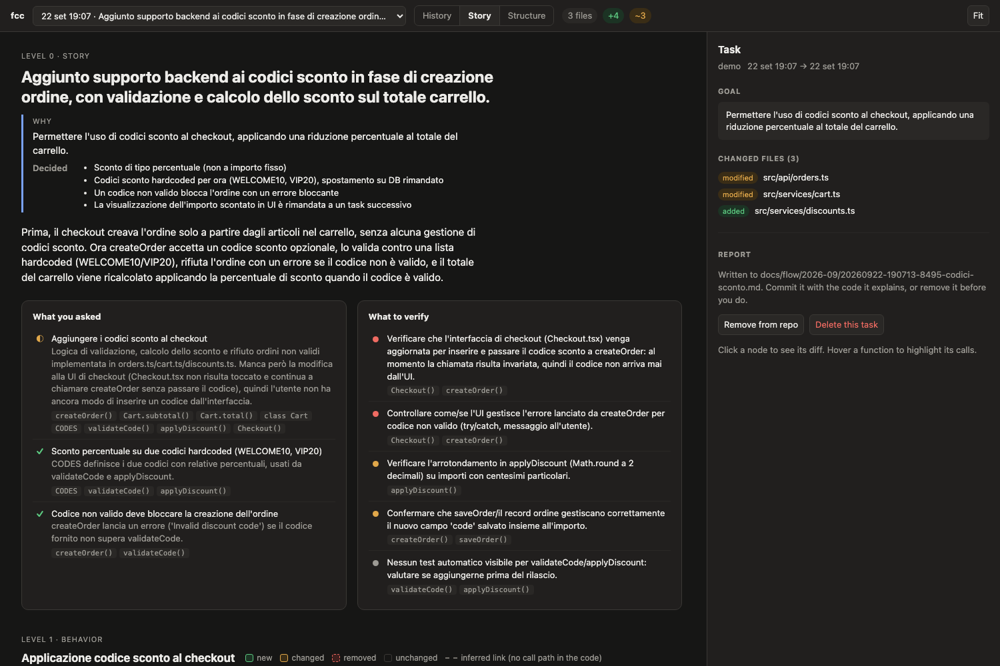
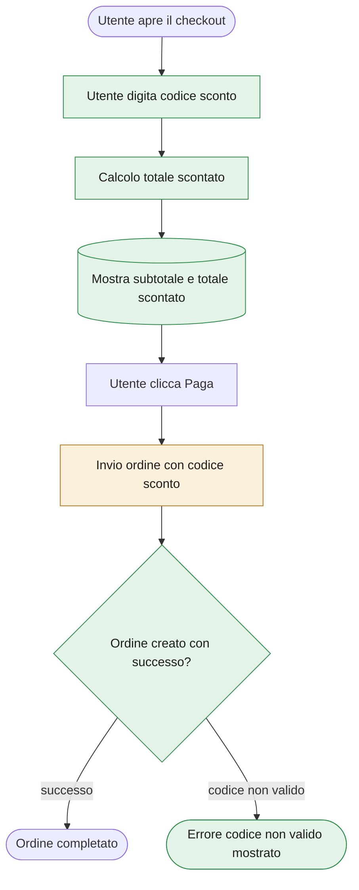
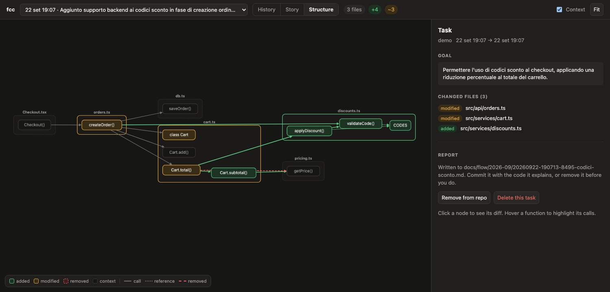
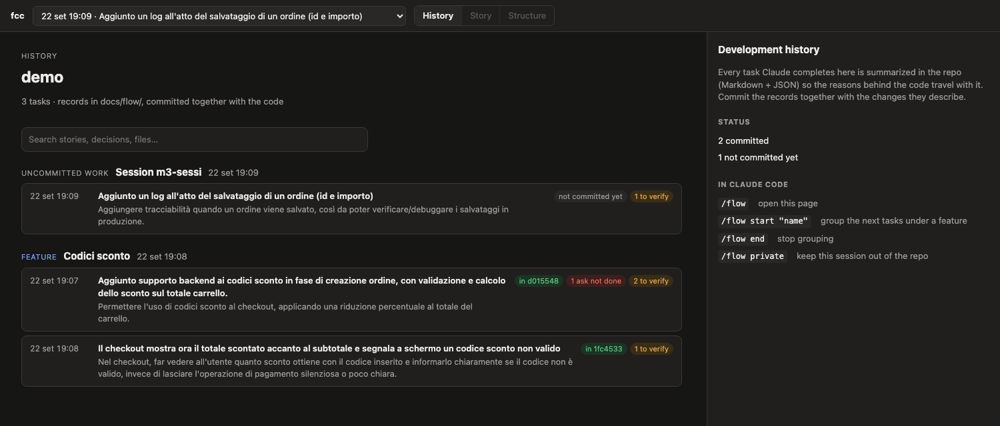

# fcc — Flowchart for Claude Code

**Read less code, still know what changed.** After every Claude Code task that
touches files, fcc prints a link to a local page that explains the work in
plain language, shows the behavior it changed, and keeps that explanation in
your repository as the project's development history.

> Early days: version 0.3.0, written for its author's daily use and developed
> on macOS. It should work on Linux; Windows is untested.

## What you get

### The story: what changed, and what to check



A headline, the **why** behind the task (goal, decisions, alternatives that
were dropped), the behavior before and after, each thing you asked for marked
done / partial / missing, and a short list of **what to verify**: unhandled
errors, changes nobody asked for, files changed outside Claude's edit tools,
missing tests. In the screenshot it caught that discount codes were
implemented in the backend but never wired into the checkout UI.

The text follows the language you write in.

### The behavior flow, anchored to real code

Each task also gets a flowchart of what happens at runtime, in domain
language, with new, changed and removed steps highlighted. This is a real one,
as GitHub renders it from the record fcc wrote:



Every step is anchored to the functions that implement it: click one in the
page and you get their diff. A link the call graph cannot back is drawn dashed
and labelled "inferred", so you always know what is grounded and what is the
model talking.

### The structure, when you do want the code



Functions, methods and classes added, modified or removed, the calls between
them, and their unchanged callers as grey context — grouped by file and
package. One more click gives you the diff of a single symbol and a link that
opens it in your editor.

### The history of the project



Every task is also written to `docs/flow/` in your repo. The History tab shows
them as a timeline grouped by feature or by commit, tells you which tasks were
committed, partly committed or discarded, and searches stories, decisions and
file names.

## What lands in your repo

One Markdown file per task (plus a JSON sidecar that fcc reads), which **you**
commit together with the code it explains:

```markdown
---
fcc: 1
task: "20260922-190815-6478"
date: "2026-09-22T17:08:15.759Z"
feature: "Codici sconto"
model: "sonnet"
---

# Il checkout mostra ora il totale scontato accanto al subtotale…

## Why

Nel checkout, far vedere all'utente quanto sconto ottiene con il codice
inserito e informarlo chiaramente se il codice non è valido…

**Decisions**

- Mostrare sia il totale scontato che il subtotale originale nel checkout
- Gli errori di codice non valido vengono mostrati con role="alert" invece
  di fallire silenziosamente

## Asks

- ✓ Mostrare l'importo scontato nel checkout — Il componente calcola e mostra
  'Totale: X (invece di Y)' usando Cart.total() e Cart.subtotal()…
```

That "why" comes from the whole conversation that led to the task, not from
the last message: after a long discussion that ends in "ok, go", the decisions
you agreed on are still there.

Don't want one? `/flow drop`, or the **Remove from repo** button in the page.
Don't want any? `/flow private` for a session, or point `FCC_HISTORY_DIR` at a
gitignored directory.

## What leaves your computer

fcc is a local tool with one outbound path: writing the story.

- **Sent to the model**: the diffs of the changed symbols, the changed file
  names, and the conversation that led to the task. They go through the Claude
  Code login you already use (`claude -p`, with a minimal context), or through
  the Anthropic API if you pick that engine.
- **Never sent**: the rest of your repository — and nothing at all leaves if
  you run `/flow model off`, which keeps the structure, the diffs and the
  history working without a model.
- **Never stored**: what you type. The conversation is read from the Claude
  Code transcript, used to write the story, then dropped; it reaches neither
  the repo nor fcc's cache, and tasks are listed by their headline.
- **No telemetry**, no account, no server of ours. The viewer listens on
  127.0.0.1 only, behind a random per-run token, and shuts down when idle.
  Everything else stays in `~/.claude/flow/`.

## Install

Requires [Claude Code](https://code.claude.com), git and Node ≥ 18. No `npm
install`: the plugin ships its own bundle.

```bash
claude plugin marketplace add <your-github-user>/fcc
```

```bash
claude plugin install fcc@fcc
```

Pick the `user` scope for every project, or `local` for just this one. To try
it without installing: `claude --plugin-dir /path/to/fcc`. Later:
`claude plugin update fcc@fcc`, `claude plugin uninstall fcc@fcc`.

Then ask Claude to change some code and open the link it prints.

## Commands

| Command | Effect |
|---|---|
| `/flow` | open the history of the current project |
| `/flow model haiku` | choose the model that writes the stories (`sonnet` by default, or `opus`, a `claude-…` id, or `off`); add `project` for this repository only |
| `/flow start "Discount codes"` | group the next tasks under a feature |
| `/flow end` | stop grouping |
| `/flow drop` | delete the last task's report so it is never committed |
| `/flow private` · `/flow public` | keep this session's tasks out of the repo, or put them back |

## Cost and speed

The hooks add about 0.1 s per turn. The structure is ready in seconds and the
story in about a minute, both in the background: Claude Code is never blocked.
With the default Sonnet a task cost about **$0.06** in our tests, charged to
the Claude Code plan you already have. Haiku is cheaper, but in the same
comparison it missed an unimplemented request and an unrequested change.

## Limits worth knowing

- **Symbol-level graphs are TypeScript and JavaScript only.** Other languages
  still get the story, the behavior flow, the history and file-level diffs.
- Calls made through dependency injection, events or dynamic dispatch are not
  linked, and only the root `tsconfig` is read.
- A task is matched to commits on the **current branch** only: work committed
  on a branch that is not merged yet reads as "not committed".
- Tasks from before you installed fcc are not reconstructed.
- Outside a git repository fcc stays silent.

## How it works

`UserPromptSubmit` snapshots the work tree as a git tree object (without
touching your index), `PostToolUse` records which files Claude edited, and
`Stop` snapshots again, then analyzes the two trees with ts-morph and asks the
model for the story, validating every reference it makes against the graph.
Tasks are matched to commits by content, so the link survives squash and
rebase. [docs/DESIGN.md](docs/DESIGN.md) has the architecture and the
decisions behind it, including the ones that were later revised.

## Development

```bash
npm install
npm test          # fixture repos + end-to-end hook tests
npm run typecheck
npm run build     # bundles dist/ (commit it: plugins install without npm)
```

Sources run directly on Node ≥ 22.18 (`node bin/fcc.ts …`); the bundle runs on
Node ≥ 18. Environment variables, which override the config files: `FCC_LLM`
(`claude` default, `api`, `off`), `FCC_MODEL`, `FCC_HOME` (state dir),
`FCC_HISTORY_DIR` (default `docs/flow`), `FCC_PORT`, `FCC_IDLE_MINUTES`
(viewer auto-shutdown, default 30), `FCC_SYNC=1` (analyze inside the Stop
hook), `FCC_NO_SERVER=1`.

Errors from hooks and background processes go to `~/.claude/flow/fcc.log`;
hooks never fail the Claude Code session.

## License

MIT — see [LICENSE](LICENSE).
